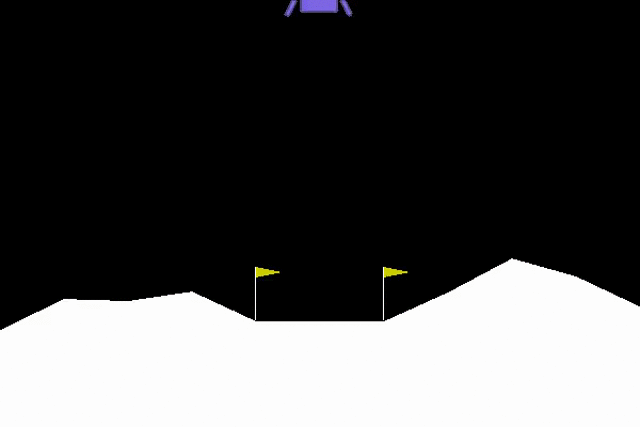

# Solving the discrete lunar lander problem with Deep Q-Network in PyTorch

LunarLander is a 2D playing environment of the [gym Python library](https://github.com/openai/gym) from OpenAI. The games provided by `gym` have a special feature: you can interact with the playing environment by command line. Therefore, by using a terminal, you can get the status of the environment, make your action and evaluate the new status of the environment, then take another action, and so on until the game termination.

To get started with `gym`, please inspect the [official page](https://www.gymlibrary.dev/). Moreover, you can find a good tutorial [here](https://blog.paperspace.com/getting-started-with-openai-gym/).

## The lunar lander problem

LunarLander is a very straightforward task: you must drive a space rover to land on the Moon's surface. By interacting with the environment, you must move the rover towards a safe landing on the Moon. At each action step, the environment returns a reward, which is a value representing the goodness of the action taken. Using reinforcement learning methods, you can program an **artificial agent** to make decisions about moves, driving the lander towards the end of the task.

The animated image below renders a playing round performed by the reinforcement learning agent implemented in this repository.



## The playing framework

The **observation space** is the set of information describing the environment at each playing step (8-dimensional vector): the coordinates of the lander in x and y, its linear velocities in x and y, its angle, its angular velocity, and two booleans that represent whether each leg is in contact with the ground or not.

The **action space** is the set of actions the agent can take. LunarLander comes with two possible action spaces: discrete and continuous. In this project, I faced the **discrete** problem, so the action space accounts for four discrete options: do nothing, fire left orientation engine, fire main engine, fire right orientation engine.

The **reward system** are the rules followed by the environment to send rewards to the agent after each action. See the [documentation](https://www.gymlibrary.dev/environments/box2d/lunar_lander/) for details.

## Content of this repository

The script `LunarLander.py` contains a Python class (`Autopilot`) that implements an agent driving the lander, which uses a Deep Q-Network (DQN) to make decisions about actions. The `cache` stores a backup of a trained agent ready to use (see the notes in the notebook `main.ipynb`). This agent solves about the 99% of episodes with a mean total reward of 254.6 (see the notebook).

## The Autopilot class

The `Autopilot` class requires four kinds of parameters for initialization. 

### Model architecture

The Deep Q-Network comes from the argument `model` as a class inheriting from `torch.nn.Module`. By default, the Q-network has two dense hidden layers of size 32 and 64 with ReLU activation functions. The inputs are the observations from the environment (8 values), while the outputs are the Q-values associated with each possible action (4 values).

Model parameters are optimized by the Adam algorithm with a learning rate `lr=0.0001`.

The DQN is implemented using experience replay and a target network that is synchronized with the leading network at the end of each episode.

### Accounting of rewards

The rewards obtained during an episode are discounted for a `gamma=0.99` as they move away from the concluding action.

### Epsilon greedy policy

The DQN algorithm is based on an *epsilon*-greedy strategy to balance exploration and exploitation. The training starts with a full random search (`epsilon_start=1.0`), and progressively decreases *epsilon* until a minimum (`epsilon_min=0.01`). The decrease is driven by a coefficient (`epsilon_decay=0.999`) updating the current *epsilon* value after each episode.

### Experience replay

During training, the agent store experience using a `memory_buffer` of 65,536 events with a `replay_buffer` accounting for 64 events.

## Playing with the autopilot

```
# Import the package
import LunarLander as ll

# Define the environment
env = gym.make('LunarLander-v2')

# Load the trained agent from the cache
with open('cache/agent.pickle', 'rb') as file:
    agent = pickle.load(file)

# Play an episode
ll.play(env, agent, render=True, sleep=0.01)
```
